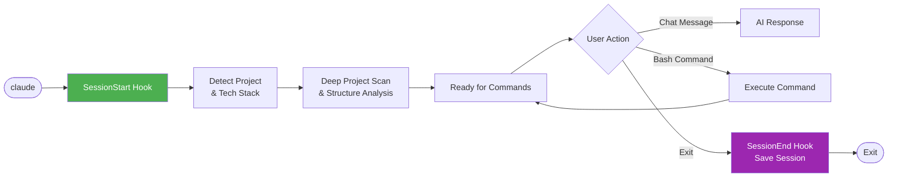

# 🎼 Maestro

> **AI Development Orchestrator** - Transform Claude into a powerful development team with specialized agents, intelligent skills, and automated workflows.

[](#-agents)
[](#-skills)
[](#-commands)
[](#-scripts)

---

## ✨ Features

- 🤖 **15 Specialized Agents** - Expert AI personas for frontend, backend, mobile, DevOps, security, and more
- 📚 **43 Skills** - Domain knowledge resources with patterns, best practices, and templates
- ⚡ **8 Slash Commands** - Quick actions for creating apps, debugging, testing, and deploying
- 🐍 **12 Python Scripts** - Automation hooks for error learning, session management, and project discovery
- 🎯 **Clean Code Standards** - CRITICAL skill for concise, direct, solution-focused code
- 🎭 **6 Behavioral Modes** - Adaptive AI behavior: Brainstorm, Implement, Debug, Review, Teach, Ship
- 🔄 **Project Detection** - Automatically detects project type and tech stack
- 🧩 **Parallel Orchestration** - Run multiple specialized agents concurrently for different perspectives
- 🧠 **Synthesis Reporting** - Automatically combines multi-agent outputs into cohesive project reports

---

## 🚀 Quick Start

### Create an Application

```bash
/create e-commerce site with product listing and cart
```

The framework will:
1. Analyze your request
2. Plan the project structure
3. Coordinate specialized agents
4. Generate production-ready code
5. Start a preview server

### Add Features

```bash
/enhance add dark mode
/enhance build admin panel
```

### Other Commands

```bash
/brainstorm authentication options    # Explore ideas
/debug login not working              # Investigate issues
/test user service                    # Generate tests
/deploy production                    # Deploy safely
```

---

## 📁 Project Structure

```
maestro/
├── agents/              # 16 specialized AI agents
│   ├── frontend-specialist.md
│   ├── backend-specialist.md
│   ├── mobile-developer.md
│   ├── devops-engineer.md
│   └── ...
├── skills/              # 38 knowledge resources
│   ├── app-builder/
│   ├── behavioral-modes/
│   ├── react-patterns/
│   ├── templates/
│   │   ├── nextjs-fullstack/
│   │   ├── express-api/
│   │   ├── react-native-app/
│   │   └── nextjs-static/
│   └── ...
├── commands/            # 9 slash commands
│   ├── create.md
│   ├── enhance.md
│   ├── debug.md
│   └── ...
├── scripts/             # 12 Python automation scripts
│   ├── setup.py         # Cross-platform installer
│   ├── session_hooks.py
│   ├── parallel_orchestrator.py
│   ├── explorer_helper.py
│   ├── session_manager.py
│   └── auto_preview.py
├── data/                # Runtime state and error database
├── settings.example.unix.json     # Hook config (macOS/Linux)
├── settings.example.windows.json  # Hook config (Windows)
├── CLAUDE.md           # AI behavior configuration
└── README.md           # This file
```

---

## 🔄 Hook System Flow

The framework uses an intelligent hook system that automatically detects projects and manages sessions:


**Key Features:**
- 🔍 **Auto-Detection:** Finds your project type (Next.js, React Native, Python, etc.)
- 📊 **Project Context:** Remembers each project separately
- 🔍 **Deep Discovery:** Scans project structure and dependencies
- 🖥️ **OS Detection:** Detects OS and injects appropriate terminal commands

For detailed hook architecture, see **[scripts/README.md](scripts/README.md#hook-system-architecture)**.

---

## 🤖 Agents

Specialized AI agents that handle different aspects of development:

| Agent | Expertise | Lines |
|-------|-----------|-------|
| **explorer-agent** | Codebase exploration, dependency research | 210 |
| **debugger** | Root cause analysis, systematic debugging | 250+ |
| **api-designer** | REST/GraphQL, OpenAPI, API security | 521 |
| **mobile-developer** | React Native, Flutter, Expo, App Store | 354 |
| **devops-engineer** | PM2, deployment, CI/CD, rollback | 275 |
| **test-engineer** | Testing strategies, TDD, coverage | 268 |
| **security-auditor** | Security review, vulnerabilities | 229 |
| **orchestrator** | Multi-agent coordination | 209 |
| **database-architect** | Schema design, Prisma, migrations | 189 |
| **backend-specialist** | Node.js, Express, FastAPI | 187 |
| **frontend-specialist** | React, Next.js, Tailwind | 149 |
| **project-planner** | Task breakdown, planning | 140 |
| **performance-optimizer** | Performance profiling | 132 |
| **documentation-writer** | README, API docs | 98 |

Each agent includes:
- Domain expertise and best practices
- Code patterns and examples
- Review checklists
- Trigger keywords for automatic selection

---

## 📚 Skills

Knowledge resources that agents reference for domain expertise:

### 🏗️ Architecture & Patterns
- `api-patterns` - REST/GraphQL design patterns
- `react-patterns` - React component patterns
- `mobile-patterns` - Mobile development patterns
- `nodejs-best-practices` - Node.js 23 patterns (Native TS, SQLite)
- `nextjs-best-practices` - Next.js 15 App Router & React 19 patterns
- `frontend-design` - 2025 Design Precision (8-point grid, Golden Ratio)

### 🎨 Templates
| Template | Description | Tech Stack |
|----------|-------------|------------|
| **nextjs-fullstack** | Full-stack web app | Next.js, Prisma, TypeScript, Tailwind |
| **express-api** | REST API | Express, JWT, Zod, Prisma |
| **react-native-app** | Mobile app | Expo, React Query, Zustand |
| **nextjs-static** | Landing page | Next.js, Framer Motion, Tailwind |

### 🛠️ Operations
- `server-management` - Server administration
- `deployment-procedures` - Safe deployment
- `performance-profiling` - Performance analysis
- `systematic-debugging` - Debugging methodology
- `mobile-ux-patterns` - Touch gestures, haptics, accessibility

---

## ⚡ Commands

| Command | Description | Mode |
|---------|-------------|------|
| `/create` | Create new application from natural language | IMPLEMENT |
| `/enhance` | Add features to existing app | IMPLEMENT |
| `/preview` | Start/stop preview server | UTILITY |
| `/status` | Show project and agent status | UTILITY |
| `/brainstorm` | Structured idea exploration | BRAINSTORM |
| `/debug` | Systematic problem investigation | DEBUG |
| `/test` | Generate and run tests | IMPLEMENT |
| `/deploy` | Production deployment with safety checks | SHIP |

---

## 🔧 Makefile Commands

Maestro includes a Makefile for easy management:

### Setup Commands
```bash
make install       # Full installation to ~/.claude
make install-deps  # Install Python dependencies only
make uninstall     # Remove Maestro (preserves data)
make verify        # Verify installation status
```

### Development Commands
```bash
make setup-dev     # Setup development environment
make test          # Run tests
make lint          # Run linters (flake8, black)
make clean         # Clean temporary files
```

### Utility Commands
```bash
make token-stats   # Show token usage statistics
make commit        # Generate smart commit message
make commit-copy   # Generate and copy to clipboard
make git-stats     # Show repository statistics
make status        # Show current project status
make agents        # List available agents
make skills        # List available skills
```

### Quick Reference
| Command | Description |
|---------|-------------|
| `make install` | Install Maestro to ~/.claude |
| `make verify` | Check installation status |
| `make commit` | AI-powered commit message |
| `make token-stats` | View token/cost usage |
| `make agents` | List all 15 agents |
| `make skills` | List all 40+ skills |

---

## 🐍 Scripts

Python automation scripts that provide intelligent hooks:

### Hook Scripts (Automatic)
| Script | Hook | Purpose |
|--------|------|---------|
| `session_hooks.py` | SessionStart/End | Project detection, session tracking |
| `explorer_helper.py` | SessionStart | Deep project discovery |
| `pre_bash.py` | PreToolUse | Error learning - warns about known issues |
| `check_prevention.py` | PreToolUse | Blocks dangerous commands |
| `track_error.py` | PostToolUse | Records errors for learning |
| `token_tracker.py` | PostToolUse/SessionEnd | Token usage & cost estimation |

### Utility Scripts (Manual)
| Script | Purpose |
|--------|---------|
| `parallel_orchestrator.py` | Multi-agent parallel execution with streaming UI |
| `session_manager.py` | Project state management |
| `auto_preview.py` | Preview server control |
| `git_commit_helper.py` | Smart commit message generation |
| `maestro.py` | Unified CLI wrapper |
| `error_formatter.py` | Human-friendly error messages |

### Dependencies

```bash
pip install rich pydantic
```

---

## 🎭 Behavioral Modes

The framework adapts its behavior based on context:

| Mode | Trigger Keywords | Behavior |
|------|------------------|----------|
| **BRAINSTORM** | "ideas", "options", "what if" | Explore alternatives, ask questions |
| **IMPLEMENT** | "build", "create", "add" | Fast execution, production code |
| **DEBUG** | "error", "not working", "bug" | Systematic investigation |
| **REVIEW** | "review", "check", "audit" | Thorough constructive analysis |
| **TEACH** | "explain", "how does" | Educational explanations |
| **SHIP** | "deploy", "production" | Pre-flight checks, safety first |

---

## 🔄 Hook System Flow

The framework uses an intelligent hook system that automatically detects projects:



---

## 🧠 Multi-Agent Orchestration

The framework supports parallel execution through the `parallel_orchestrator.py` engine:

1. **Task Decomposition**: The orchestrator assigns different perspectives (Security, Backend, Frontend, Testing, DevOps) to specialized agents.
2. **Parallel Dispatch**: Agents are spawned concurrently using ThreadPoolExecutor and work independently.
3. **State Tracking**: Agent status and results are tracked in `data/orchestrator-state.json` for monitoring.
4. **Synthesis**: After all agents complete, a unified synthesis report is generated in `data/reports/`.

```bash
python scripts/parallel_orchestrator.py "Analyze this codebase" --agents 3
python scripts/parallel_orchestrator.py "Analyze this codebase" --agents 5 --test  # Test mode with mock results
```

**Note:** Agents work independently and do not directly communicate with each other. Each agent produces its own output, which is then synthesized into a final report.

---

## Configuration

Hooks are configured in `~/.claude/settings.json`. Platform-specific examples are provided:

- **macOS/Linux**: `settings.example.unix.json`
- **Windows**: `settings.example.windows.json`

Example structure (macOS/Linux):

```json
{
  "hooks": {
    "SessionStart": [
      {
        "matcher": "startup",
        "hooks": [
          { "type": "command", "command": "python3 ~/.claude/scripts/session_hooks.py start --silent" }
        ]
      }
    ],
    "PreToolUse": [
      {
        "matcher": "Bash",
        "hooks": [
          { "type": "command", "command": "python3 ~/.claude/scripts/pre_bash.py \"$TOOL_INPUT\"" }
        ]
      }
    ]
  }
}
```

### How Context Injection Works

**`CODEBASE.md`** is auto-generated in your project root on every session start:

| Step | Action | Purpose |
|------|--------|---------|
| 1 | Hook runs `session_hooks.py start` | Trigger on session start |
| 2 | Creates `CODEBASE.md` in project root | Reference file for you |
| 3 | Outputs content to stdout | **Claude receives context** |
| 4 | Claude reads stdout | Auto-injected project info |

> **Why project root?** Easy to find and reference. Hook stdout ensures Claude always receives context.

See [HOOKS-TROUBLESHOOTING.md](HOOKS-TROUBLESHOOTING.md) for complete examples for each platform.

---

## 📊 Statistics

| Category | Count |
|----------|-------|
| Agents | 15 |
| Skills | 43 |
| Commands | 8 |
| Scripts | 12 |
| Templates | 12 |
| Behavioral Modes | 6 |
| Hook Scripts | 2 (session_hooks, explorer_helper) |

---

---

## 🔧 Troubleshooting

### ❌ Hooks Not Working?

If your `SessionStart` or `SessionEnd` hooks are not triggering, you likely need to add the `matcher` property to your hook configuration.

**See [HOOKS-TROUBLESHOOTING.md](HOOKS-TROUBLESHOOTING.md) for detailed solutions.**

**Quick Fix:**

❌ **Wrong (won't work):**
```json
"SessionStart": [
  {
    "command": "python script.py"
  }
]
```

✅ **Correct (will work):**
```json
"SessionStart": [
  {
    "matcher": "startup",
    "hooks": [
      {
        "type": "command",
        "command": "python script.py"
      }
    ]
  }
]
```

**Debug your hooks:**
```bash
claude --debug
```

Check the debug log at `~/.claude/debug/[session-id].txt` and look for:
- `Found 1 hook matchers` ✅ (not `Found 0` ❌)

For complete troubleshooting guide, see **[HOOKS-TROUBLESHOOTING.md](HOOKS-TROUBLESHOOTING.md)**.

---

## 🛠️ Requirements

- Python 3.10+
- Node.js 23+ (for native TypeScript & SQLite support)
- Claude Code CLI

---

## 📦 Installation

### Quick Setup with Makefile (Recommended)

```bash
# Clone the repository
git clone https://github.com/aliihsansepar/claude-code-maestro.git
cd claude-code-maestro

# Install with one command
make install

# Verify installation
make verify
```

### Alternative: Interactive Setup

```bash
# Run the interactive TUI installer
python scripts/setup.py

# Or quick install without prompts
python scripts/setup.py --quick
```

The setup will:
1. Detect your operating system (Windows, macOS, or Linux)
2. Install Python dependencies (rich, pydantic)
3. Copy scripts to `~/.claude/scripts/`
4. Install the appropriate settings file
5. Create the data directory structure

### Manual Installation

#### macOS / Linux

```bash
# Create directories
mkdir -p ~/.claude/scripts ~/.claude/data/projects ~/.claude/data/reports

# Copy scripts
cp scripts/*.py ~/.claude/scripts/

# Copy settings
cp settings.example.unix.json ~/.claude/settings.json
```

#### Windows (PowerShell)

```powershell
# Create directories
New-Item -ItemType Directory -Force -Path "$env:USERPROFILE\.claude\scripts"
New-Item -ItemType Directory -Force -Path "$env:USERPROFILE\.claude\data\projects"
New-Item -ItemType Directory -Force -Path "$env:USERPROFILE\.claude\data\reports"

# Copy scripts
Copy-Item scripts\*.py "$env:USERPROFILE\.claude\scripts\"

# Copy settings
Copy-Item settings.example.windows.json "$env:USERPROFILE\.claude\settings.json"
```

### Verify Installation

```bash
claude --debug
```

Check the debug log at `~/.claude/debug/[session-id].txt` for "Found X hook matchers"

---

## 📄 License

MIT License - See [LICENSE](LICENSE) for details.

---

## 🤝 Contributing

Contributions are welcome! Please read the documentation in each directory's README.md for specific guidelines.

---

<p align="center">
  <b>🎼 Maestro - Built with ❤️ for AI-assisted development</b><br/>
  <a href="https://x.com/xenit_v0">@xenit_v0</a>
</p>
