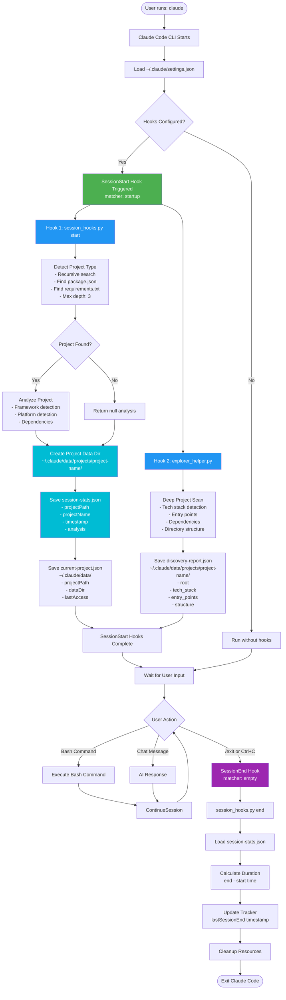

# 🐍 Maestro Scripts

Python automation scripts for hooks and utilities.

## Hook Scripts

These run automatically via `settings.json` hooks:

| Script | Hook | Purpose |
|--------|------|---------|
| [session_hooks.py](session_hooks.py) | SessionStart/End | Project detection, session tracking, dependency analysis |
| [explorer_helper.py](explorer_helper.py) | SessionStart | Deep project discovery |
| [lint_check.py](lint_check.py) | - | 🕵️ AI Quality Audit (Rich/V5) |
| [dependency_scanner.py](dependency_scanner.py) | SessionStart | 🆕 Dependency Analysis |

## Utility Scripts

| Script | Purpose |
|--------|---------|
| [lint_check.py](lint_check.py) | 🕵️ AI-controlled quality audit (Rich Tables & Panels) |
| [session_manager.py](session_manager.py) | Project state management |
| [auto_preview.py](auto_preview.py) | Preview server control |
| [setup.py](setup.py) | 🆕 Cross-platform installation script |
| [auto_update.py](auto_update.py) | 🔄 **NEW** Safe GitHub auto-update system |

## 🔄 Manual Update System (`/maestro` Command)

## 🔄 Auto-Update System

### Overview

The `auto_update.py` script provides **safe, automated updates** from GitHub with:

- ✅ **Update detection** - Compares local vs remote commits
- ✅ **Local change protection** - Stash/commit/discard options before update
- ✅ **File sync** - Handles remote file deletions safely
- ✅ **Automatic backup** - Creates backup before update
- ✅ **Rollback** - Automatic rollback on failure
- ✅ **Rich UI** - Beautiful terminal output

### Usage

```bash
# Check for updates
python auto_update.py check

# Update from GitHub (interactive)
python auto_update.py update

# Force update (discards local changes)
python auto_update.py update --force

# Sync repo files to ~/.claude directory
python auto_update.py sync

# Or use the /maestro slash command in Claude CLI
/maestro
```

### What It Does

1. **Pre-Update Checks:**
   - Compares local commit with GitHub origin/main
   - Detects local changes (modified, new, deleted files)
   - Shows what will be updated/deleted

2. **Local Change Handling:**
   - Asks what to do with local changes:
     - `stash` - Save changes temporarily (restorable after update)
     - `commit` - Commit changes first (update cancelled)
     - `discard` - Remove local changes

3. **File Synchronization:**
   - Pulls latest changes with `git pull --rebase`
   - **Removes deleted files** (`git clean -fd`)
   - Re-runs setup.py for reinstallation

4. **Backup & Rollback:**
   - Creates timestamped backup in `.maestro_backup/`
   - Stores metadata for rollback
   - Auto-rollback on failure

5. **Notification:**
   - Creates `update_notification.txt` in current directory
   - Shows what files were updated/synced

### Safety Features

| Feature | Description |
|---------|-------------|
| **Pre-flight check** | Shows all changes before applying |
| **Stash support** | Safely preserve local work |
| **Backup** | Full backup before any destructive operation |
| **Rollback** | Auto-restore on failure |
| **Confirmation prompts** | Explicit approval for destructive actions |
| **Notification file** | `update_notification.txt` created after sync |

### Example Output

```
╭─ Update Available ─────────────────────────────────────╮
│                                                        │
│  Property      │ Value                                 │
│  ────────────  │ ───────────────────────────────────── │
│  Current       │ v0.2.4                                 │
│  Latest        │ v0.2.5                                 │
│  Behind        │ 3 commits                             │
│  Local Changes │ 2 files                                │
│                                                        │
╰────────────────────────────────────────────────────────╯

Files to update: 15
  • CLAUDE.md
  • agents/mobile-developer.md
  • skills/mobile-design/...

Files to be deleted locally: 2
  • scripts/old_script.py
  • agents/deprecated.md

Found 2 local change(s):
  [Modified] agents/custom.md
  [Added] data/test.json

How would you like to proceed? [Y/n]: y
Choose option [stash/commit/discard] [stash]: stash
```

## Usage

### Hook Scripts (automatic)
```bash
# Configured in settings.json, runs automatically
python session_hooks.py start
```

### Utility Scripts (manual)
```bash
# Session manager
python session_manager.py init --path /project --type nextjs
python session_manager.py status

# Auto preview
python auto_preview.py start
python auto_preview.py stop

# Quality Audit (AI-controlled with Rich UI)
python lint_check.py <file_path>
```

## Dependencies

```bash
pip install rich pydantic
```

- **rich**: Beautiful terminal output
- **pydantic**: Type-safe data models

## Data Files

Scripts read/write to `~/.claude/data/`:
- `session-stats.json` - Session metadata per project
- `current-project.json` - Global project reference
- `discovery-report.json` - Project structure analysis

---

# 🔄 Hook System Architecture

## System Flow Diagram



## 📋 Detailed Component Breakdown

### 1. SessionStart Hook (Startup)

**Triggers:** When Claude Code starts
**Scripts:**
- `session_hooks.py start --silent`
- `explorer_helper.py . --silent`

**Process:**
1. Detect current working directory
2. Recursively search for project files (depth: 3)
3. Identify framework (React Native, Next.js, Django, etc.)
4. Create project-specific data directory
5. Save session metadata
6. Scan project structure and dependencies

**Output:**
```
~/.claude/data/
├── projects/
│   └── {project-name}/
│       ├── session-stats.json
│       └── discovery-report.json
└── current-project.json
```

---

### 2. SessionEnd Hook (Exit)

**Triggers:** When user exits Claude Code
**Script:** `session_hooks.py end --silent`

**Process:**
1. Load session start time from `session-stats.json`
2. Calculate total session duration
3. Update session end timestamp
4. Output session summary (if not silent)

**Output Example:**
```
Session completed
Duration: 0:45:23
```

---

## 🗄️ Data Storage Structure

```
~/.claude/data/
├── projects/
│   ├── project-a/
│   │   ├── session-stats.json        # Session metadata
│   │   └── discovery-report.json     # Project structure
│   │
│   └── project-b/
│       ├── session-stats.json
│       └── discovery-report.json
│
├── current-project.json              # Global reference
└── hook_debug.log                    # Debug log
```

---

## 🔐 Security & Safety Features

1. **Project Isolation:** Separate data per project
2. **Silent Mode:** No user interruption
3. **Debug Logging:** Full audit trail

---

## 🎯 Key Benefits

- **Automatic Project Detection** - No manual configuration
- **Project Context** - Remembers each project separately
- **Zero User Intervention** - Runs silently in background
- **Debugging Support** - Full logging for troubleshooting

---

## 🐛 Known Limitations (Claude Code v2.0.64)

1. **SessionStart Context Issue:** Output not injected into new conversations
   - **Workaround:** Use `/clear` or `/compact` to trigger properly

2. **Hook Output Visibility:** Only visible with `--debug` flag
   - **Workaround:** Run `claude --debug` to see execution

3. **Matcher Required:** Must use `matcher` + `hooks` structure
   - **Solution:** See [HOOKS-TROUBLESHOOTING.md](HOOKS-TROUBLESHOOTING.md)

---

**Last Updated:** 2026-01-06
**Version:** 2.1
**Claude Code:** v2.0.64

